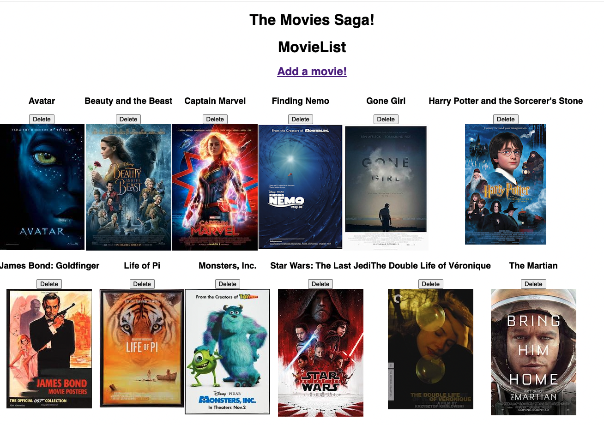
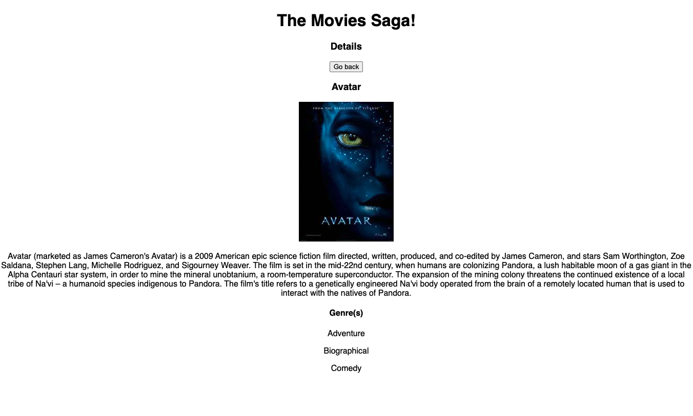

# Movie Sagas

## Description

_Duration: 1 (very long) Day Sprint_

For this Full Stack project I expanded on a movie management application. Movies from the database were already shown on the screen. It was my job to create a detailed view for each individual movie when the user clicks on a movie poster, including all genres associated with that movie. I also added the ability for users to delete a movie and add a new movie.

## Interface

##

## Installation

([Node.js](https://nodejs.org/en/) is used in this project)

To locally run the project...

1. Create a database named `saga_movies_weekend`,
2. The queries in the `database.sql` file are set up to create all the necessary tables and populate those tables with the data to allow the application to run correctly. The project is built on [Postgres](https://www.postgresql.org/download/), so you will need to make sure to have that installed. Using Postico is recommended to run those queries as that was used to create the queries 
3. Open up your code editor of choice and run `npm install` in your terminal to install the necessary dependencies
4. Run `npm run server` in your terminal to start up the server
5. Run `npm run client` in your terminal to start up the client in your browser
6. The `npm run client` command will open up a new browser tab for you! (if not there will be a localhost link in your termainl you can use)

## Built With

- React
- Redux
- Redux-Saga
- Express
- Node.js
- PostgreSQL

## Acknowledgement
Thanks to [Prime Digital Academy](www.primeacademy.io)!